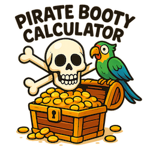

[](https://pkg.go.dev/github.com/bitfield/booty)
[](https://goreportcard.com/report/github.com/bitfield/booty)


# Booty: A Pirate Treasure Sharing Calculator



A simple Go command-line tool for calculating how to fairly divide pirate treasure among a crew, where the captain receives a double share.

## Purpose

This project is a demonstration of collaborating with [Junie](https://www.jetbrains.com/junie/) (an AI assistant) to produce a simple Go project through iterative development. The tool calculates treasure distribution following a traditional pirate code: the captain gets twice the share of a regular crew member.

## Features

- Interactive command-line interface
- Calculates individual crew shares with captain receiving a double portion
- Shows any remainder left over
- Comprehensive unit tests that run in parallel
- Clean separation of business logic and I/O

## The PIRATE workflow

It's an acronym I made up, but it's helpful for remembering the six steps of working effectively with AI coding agents:

**P is for Plan**: tell the AI what you want it to do, and ask it to show a plan before doing anything. That way, you can correct any misunderstandings and give extra instructions to refine the plan before executing it.

**I is for Iterate**: instead of trying to do the whole task in one go, move one small step at a time, making sure everything is right before moving on to the next.

**R is for Review**: look at the AI's work and give detailed feedback about the changes you want. Put all your code review comments together as a single prompt, to save tokens and code churn.

**A is for Assess**: at each stage, has the AI actually achieved what you asked for? Does the program run, pass tests, and do everything it's supposed to? Are there any weird side effects or unexpected behaviour?

**T is for Test**: as you move step by step to build the program, make sure that each new piece of functionality is covered by a test. Use the AI to draft the tests, but then go through them carefully yourself asking "What is this really testing? Are we missing some possible inputs or code paths? What about weird edge cases?"

**E is for Evaluate**: at the end of the task, review your prompts and the AI's responses. What did you learn? What did the AI do well, and where did it get things wrong? Can you see why it went wrong? How could you have improved your prompt to avoid the mistake?

## Development Journey (my prompts)

This project was built through a series of prompts to Junie, evolving from a simple concept to a well-structured Go application. The exact prompts from the development are included below:

### Prompt 1: Initial planning
> *Arr, Junie, me hearty. I'm a swashbuckling pirate cap'n who needs a Go program to help me calculate how to share out the booty from my latest captured treasure ship. Don't code anything yet, but show me a brief plan of what the tool might look like and how it would be structured.*

### Prompt 2: First iteration on the plan

> *Let's start with a much simpler version of that: I'd like to be able to run the `booty` calculator and answer two questions: the number of crew, and the number of pieces of eight to be divided among them. Assume everyone has an equal share. The tool should print out how much each crew member is due. Write just enough code to achieve this, and then we'll think about the next stage.*

### Prompt 3: Review, refactoring and quality improvements
> *Nice job, Junie, but I have a few suggestions for improvement.*
>
> *1. Instead of creating a `bufio.Scanner` in `main` and passing a pointer to it into the `askInt` function, let's eliminate some of that paperwork. Change `askInt` to take just the prompt string, and have it create the scanner internally.*
>
> *2. The `askInt` function shouldn't print error messages and call `os.Exit` if there's a scan error. Instead, have it return any error along with the integer result. Let `main` take care of all the printing and exiting.*
>
> *3. If there's an error from `strconv.Atoi`, include the invalid input in the error message. For example, "Sorry, I didn't understand %q. Please enter a whole number."*
>
> *4. Move the shares calculation into its own function, so that we decouple the input/output code from the business logic. Have it return the share and remainder values, so that `main` can print them out.*

### Prompt 4: Assessment of progress and adjustment

> *Shiver me timbers, Junie, that be some fine work. Could you now please move the business logic functions into a `booty` package in the project root, and put the `main.go` file into a `cmd/booty` subfolder? Also, could you change the plunder calculations so that the captain gets twice the share of a regular crewmember? Print out the captain's share separately.*

### Prompt 5: Testing and validation

> *Arr, please add some unit tests now for the `CalculateShares` function. Generate at least ten test cases. Move the `askInt` function into the `booty` package too, and add logic to check that the number entered is always 1 or greater, or return an appropriate error if it's not. Have the function take an `io.Reader` to read input from, and an `io.Writer` to print prompts to. Generate two tests for this function, one for valid inputs, one for invalid inputs.*

And a few test improvements:

> *Tis a fine set of tests ye have there, Junie. Could you make them all run in parallel, and in the table tests could you use a map of test cases keyed by name, and then use `t.Run` in the test loop with the map key as the subtest name? That'll make it easier on any scurvy dogs trying to understand the failure output.*
>
> *Also, don't try to inspect the error string itself for invalid inputs; that leads to fragile tests. Instead, just check that `AskInt` returns any non-nil error for these cases.*

## Installation

You can install the CLI like so:

```bash
go install github.com/bitfield/booty/cmd/booty@latest
```

You can also run without installing:

```bash
go run github.com/bitfield/booty/cmd/booty@latest
```

Or clone the repo and build locally:

```bash
git clone https://github.com/bitfield/booty.git
cd booty
go build ./cmd/booty
```

## Usage

Run the tool and answer the prompts:

```bash
$ booty
How many crew? 3
How many pieces of eight? 10
Each crew member gets 2 piece(s) of eight.
The captain gets 4 piece(s) of eight.
Remainder: 2 piece(s) of eight left over.
```

## Algorithm

The treasure distribution follows this formula:
- Divisor: `crew + 1` (the captain counts as two shares)
- Regular crew share: `total / divisor`
- Captain's share: `2 × regular_crew_share`
- Remainder: `total % divisor`

## Key Learning Points
This project demonstrates:
- Iterative software development through conversation
- Separation of concerns (business logic vs. I/O)
- Testable code design with dependency injection
- Comprehensive testing with table-driven tests and parallel subtests
- Proper Go project structure with the `cmd/` pattern
- Error handling best practices

## License
This be free software for all ye scallywags to use as ye please under the terms o' the [MIT license](LICENSE)!
